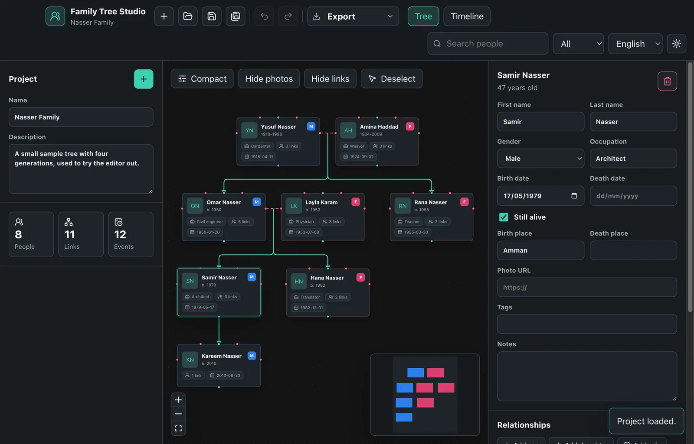
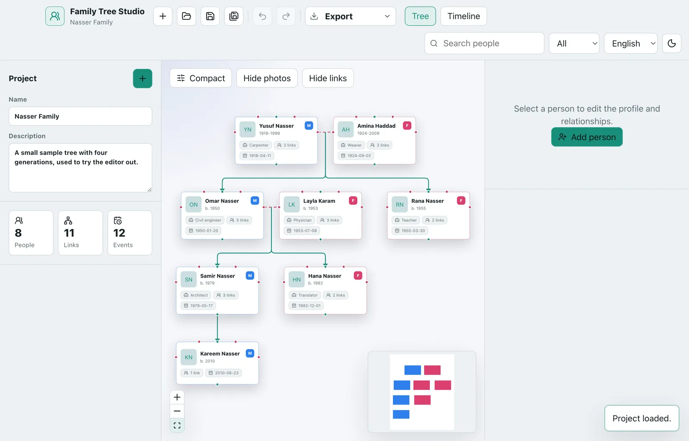
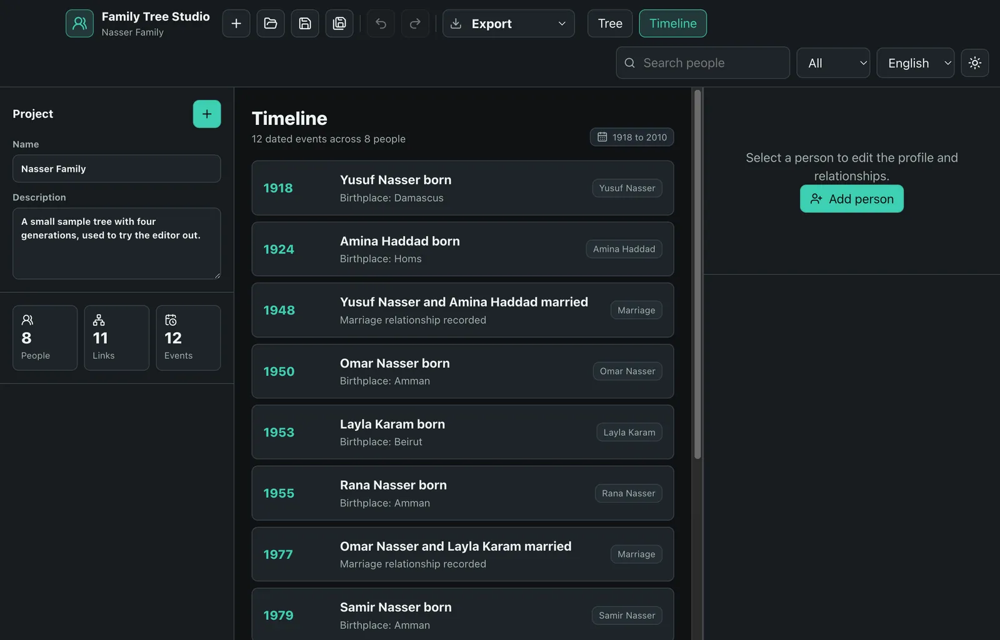
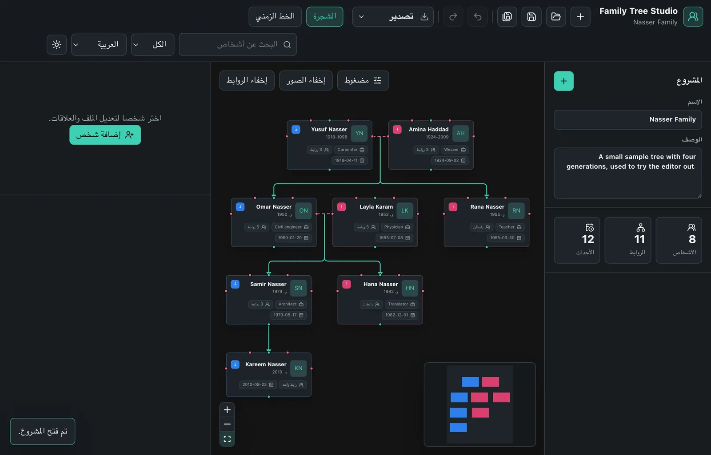

# Family Tree Studio

A desktop workspace for building family trees: structured profiles, real
relationship rules, automatic layout, undo/redo, and clean PNG / SVG / PDF
exports. Projects are plain `.ftree` files that live on your own machine.

Built with Electron, React, TypeScript and React Flow.

> No account, no license key, no network calls. Install it and start editing.



| | |
| --- | --- |
|  |  |
|  | |

---

## Quick start

```sh
npm install
npm run dev
```

`npm run dev` starts Vite, waits for it, then launches Electron against it with
the renderer devtools open. Edits to `src/` hot-reload; edits to `shell/` need
a restart.

New projects open on a welcome screen with an **Explore the sample** button, or
open `examples/sample-family.ftree` directly.

Requires Node 20.19 or newer.

## Checks

```sh
npm run typecheck   # renderer, Node and Electron projects
npm test            # unit tests (Vitest)
npm run build       # typecheck, bundle the renderer, build the Electron entries
npm run smoke       # boots the built app and drives it over the DevTools protocol
```

`npm run smoke` needs a built app and a display. On a headless Linux machine:

```sh
xvfb-run -a npm run smoke
```

It exists because a broken preload is invisible from the outside: the window
still renders, it has just silently lost every file operation. It checks the
bridge, the renderer's isolation, opening a project named on the command line
by a *relative* path, fitting the tree into view, undo, and the Arabic layout.

The renderer runs in Chromium's sandbox. On Linux that needs either
unprivileged user namespaces or the setuid helper:

```sh
sudo chown root node_modules/electron/dist/chrome-sandbox
sudo chmod 4755 node_modules/electron/dist/chrome-sandbox
```

Where neither is available (a container running as root, for example) pass
`--no-sandbox` to run without it: `npm run smoke -- --no-sandbox`. The Linux
AppImage does this on its own on systems without user namespaces.

CI (`.github/workflows/ci.yml`) runs typecheck, tests and a build on Linux,
Windows and macOS - the shell's file handling is platform specific, so its
tests run natively on each - plus the smoke test on Linux.

## Building installers

```sh
npm run package:mac    # macOS   -> dmg + zip (x64 and arm64)
npm run package:win    # Windows -> NSIS installer (x64, arm64) + portable exe
npm run package        # every target configured for the current platform
```

Artifacts land in `release/`.

**Each installer format has to be built on its own platform.** A macOS `.dmg`
needs macOS, and a Windows NSIS installer needs Windows (or Wine). Pushing a
`v*` tag runs `.github/workflows/release.yml`, which builds macOS, Windows and
a Linux AppImage in parallel and uploads them as workflow artifacts.
`workflow_dispatch` runs it on demand.

### Signing

- **macOS** - with no certificate configured the release workflow ad-hoc signs
  (`-c.mac.identity=-`). An unsigned, repacked arm64 app is reported by macOS as
  "damaged"; ad-hoc signing makes it launch, with the usual "unidentified
  developer" prompt. Set the `CSC_LINK` and `CSC_KEY_PASSWORD` repository
  secrets to sign with a Developer ID certificate, and add `APPLE_ID`,
  `APPLE_APP_SPECIFIC_PASSWORD` and `APPLE_TEAM_ID` to notarize.
- **Windows** - unsigned by default, so SmartScreen warns on first launch. Set
  the same `CSC_LINK` / `CSC_KEY_PASSWORD` secrets to sign.

There is no auto-update: nothing in the app talks to a server.

## Features

- **Profiles** - names, gender, dates, places, occupation, photo URL, tags and
  free-text notes.
- **Relationships** - add a father, mother, son, daughter or spouse in one
  click from the inspector or by right-clicking a card; link existing people
  from the same panel; record marriage dates.
- **Rules that hold the tree together** - a person cannot be their own
  ancestor, cannot have two parents of the same gender, cannot marry a close
  relative, and cannot be both spouse and parent of the same profile. Changing
  someone's gender is refused if it would break a link they already have.
- **Automatic layout** - generations resolve into rows; couples stay together;
  siblings stay together, ordered by birth date, under their parents; parents
  centre over their children; a husband with several wives keeps each wife's
  children under her; a married-in spouse sits beside their partner while their
  own parents settle next to the family; a parent with no recorded ancestry - a
  mother added later, an in-law's parents - sits just above their children
  rather than on the top row. Unconnected families sit side by side.
- **Family lines** - each couple's children hang from one line that drops from
  the middle of their marriage line, and every family between two rows gets
  its own rail, so the children of one wife are never drawn as another's.
- **Undo and redo** - every edit, with typing folded into one step. Undoing back
  to the saved state clears the "unsaved" mark.
- **Two views** - the tree canvas and a chronological timeline of births,
  deaths and marriages. Clicking a timeline entry jumps to that person.
- **Search and filter** across every text field - accent-insensitive in Latin
  script and tolerant of Arabic spelling variants - plus a gender filter.
- **Export** the whole tree - not just what is on screen - to PNG, SVG or PDF.
  SVG files carry only the styles the picture needs (about 200 KB for the
  sample).
- **English and Arabic**, with full right-to-left layout. Native menus -
  including the standard Edit, View and Window items - and dialogs follow the
  interface language.
- **Dark and light themes**, following the system preference on first launch.
- **Safe saving** - files are written atomically, so a crash or a full disk
  never leaves a half-written project. The window remembers its size.

## Keyboard shortcuts

| Action | macOS | Windows / Linux |
| --- | --- | --- |
| New project | `⌘N` | `Ctrl+N` |
| Open project | `⌘O` | `Ctrl+O` |
| Save | `⌘S` | `Ctrl+S` |
| Save as | `⇧⌘S` | `Ctrl+Shift+S` |
| Export as PDF | `⌘E` | `Ctrl+E` |
| Undo | `⌘Z` | `Ctrl+Z` |
| Redo | `⇧⌘Z` | `Ctrl+Y` |
| Add person | `⇧⌘N` | `Ctrl+Shift+N` |
| Find people | `⌘F` | `Ctrl+F` |
| Tree view | `⌘1` | `Ctrl+1` |
| Timeline view | `⌘2` | `Ctrl+2` |
| Toggle theme | `⇧⌘L` | `Ctrl+Shift+L` |
| Delete selected person | `Delete` / `Backspace` | `Delete` / `Backspace` |
| Deselect | `Esc` | `Esc` |

While a text field has focus, undo and redo act on that field.

## Project files

A `.ftree` file is formatted JSON - diffable, greppable and safe to keep in
version control. Files are parsed defensively: unknown or malformed fields are
coerced, duplicate people and repeated relationships are dropped, and
relationships pointing at people the file does not contain are discarded rather
than rendered as dangling edges. A UTF-8 byte order mark is accepted, and a file
saved by a newer version of the app is reported as such rather than misread.

Dates are `YYYY-MM-DD`; a bare year or `YYYY-MM` is also understood.

Double-clicking a `.ftree` opens it in the app once installed, and passing one
on the command line works too, with a relative path resolved against the
directory you ran the command from:

```sh
"Family Tree Studio" path/to/tree.ftree
```

## How it is put together

```
shared/          the contract between the web page and whichever shell hosts it
shell/
  core/          shell logic as plain Node: atomic saves, path rules, menu model,
                 window title, close-guard state, request validation - all tested
  electron/      the Electron adapter: main process, menu conversion, preload
src/             React renderer
  components/    UI
  lib/           domain logic - family helpers, layout, rules, file IO, exporters
  store/         Zustand store; the single source of truth for the open document
scripts/         dev runner, shell build, smoke test
examples/        a sample project to open
```

The renderer holds no privileges. Every file dialog, read, write and native
confirmation happens in the main process and is reached through a preload
bridge exposed with `contextBridge`. Windows run with context isolation and the
Chromium sandbox on, node integration off, a strict Content-Security-Policy,
permissions denied, and navigation redirected to the system browser.

The main process only saves back to a path the user actually chose (through a
dialog, a double-click or the command line), and validates every payload it
receives instead of trusting it.

Because Vite inlines every renderer library into `dist`, the packaged app ships
only `dist` and `dist-electron` - no `node_modules` tree. That is why the
libraries live in `devDependencies`.

### Hosting the app in another shell

`shared/desktop.ts` is the whole surface the renderer sees: an object with
`window.desktop`'s shape. Nothing in `src/` mentions Electron. To host the app
in a different native shell, implement that object, build the menu from
`shell/core/menuModel.ts`, and reuse `shell/core` for saving, path rules, the
window title and the close guard. Only `shell/electron` is specific to Electron.

## Notes

- Photos are referenced by URL and fetched over HTTPS at display time; they are
  not copied into the project file, and opening someone else's project can
  therefore contact the hosts it names. A broken URL falls back to initials, and
  **Hide photos** stops the requests.
- The app makes no other network requests.
- Earlier versions shipped a Tauri shell, a per-device license gate and a PHP
  storefront that sold keys for USDT/USDC. All of it has been removed. It
  remains in the git history if it is ever needed again.
